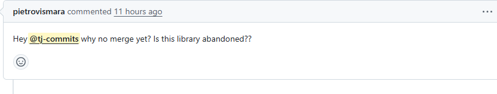

# Security Policy

For some reason, FalseJS has dependabot, and it's annoying, because it makes pull requests for "vulnerabilities" that don't affect FalseJS. Then someone complained about it in a pull request (i'm not hating on them, it's just that i don't care about dependabot alerts):

So just to clarify, I'm never merging any more dependabot alerts. FalseJS may have packages with vulnerabilities, but FalseJS itself has no vulnerabilities that come from the use of these packages, guaranteed. If you find a vulnerability, open an issue or something and we'll work it out.